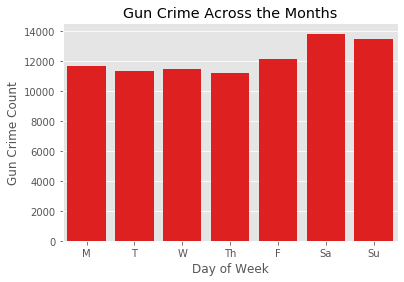
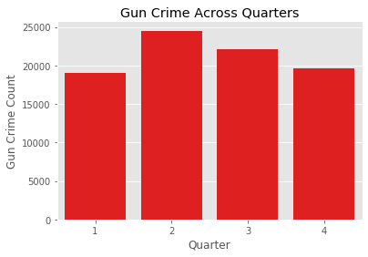
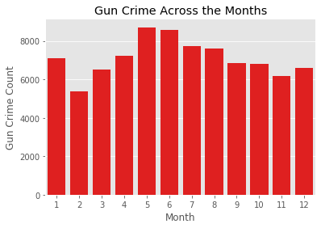
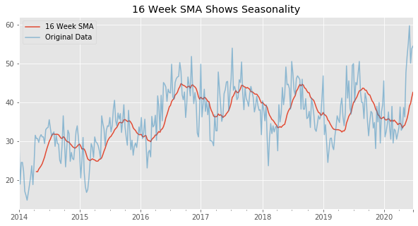
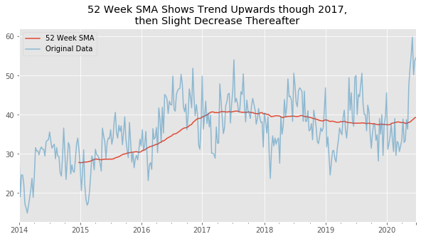
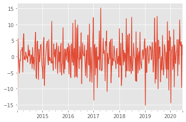

# Time Series


```python

# 1. Linear relationship between target and predictors
# 2. No multicollinearity
# 3. Errors are normally distributed
# 4. Homoscedasticity of target w.r.t. the range of predictors (residuals show no patterns)
# 5. No autocorrelation between records
```

<a id='section_1'></a>

# Time Series vs. Linear

For linear regression, we attempted to explain the variance of a continuous target variable via a set of **independent predictor features**. We assumed that there was no **autocorrelation** amongst our records.  Whereas multicolinearity describes two features whose linear increase or decrease is correlated,  autocorrelation describes whether there is a relationship between values of the same variable at different times.   


In linear regression, we make the assumption that each record is independent of the others.  In time series models, we make the opposite assumption.  We assume that a given value can best be predicted by its **past values**.

The main idea with time series is to replace our independent features with past values of our target. 

The models we will cover in lecture include endogenous variables.
<em>Endogenous</em> means caused by factors within the system. 

<em>Exogenous</em>, caused by factors outside the system. 

Many statsmodels tools use <tt>endog</tt> to represent the incoming time series data in place of the constant <tt>y</tt>.<br>

For more information visit http://www.statsmodels.org/stable/endog_exog.html

# Applications
> informed by [Practical Time Series Analysis](https://www.oreilly.com/library/view/practical-time-series/9781492041641/), Nielson)


## Healthcare
> With new methods of personalized data collection, the opportunity for time series analysis is growing.  Take health care,  where new wearable technology is producing individualized records of medical data. With a smartwatch or phone, heartrate, bloodpressure, sleep and activity records, can all be recorded easily. All of these datapoints can be timestamped precisely, and easily exported for analysis.  

> Time series are used to predict weekly flu rates

## Finance
> High frequency traders use large quantities to train time series models that trade on the microsecond level. 
> Long term time series look to model over longer periods (hours, days, months) are still relevant and employed by traditional trading firms.

## Government
> Government databases, which serve an important purpose of gathering data related to the wellfare of its citizens, are a rich source for time series data.  These databases contain time series related to:
   - Unemployment
   - Global warming
   - Crime (gun crime will be the example of today's lessons)

## A few examples visualized


## Agenda

1. [Date Time Objects](#section_2)
2. [Time Series Preprocessing Techniques](#section_3)
 - [Resampling](#resampling)
 - [Interpolating](#interpolation)
4. [Components of Time Series Data and Stationarity](#components)
 - [Decomposition](#decomposition)
 - [Stationarity](#stationarity)
 - [Dickey-Fuller](#dickey-fuller)
    

<a id='section_2'></a>

# 1: Datetime objects

Datetime objects make our time series modeling lives easier.  They will allow us to perform essential data prep tasks with a few lines of code.  

We need our time series **index** to be datetime objects, since our models will rely on being able to identify the previous chronological value.

There is a datetime [library](https://docs.python.org/2/library/datetime.html), and inside pandas there is a datetime module as well as a to_datetime() function.


Let's import some data on **gun violence in Chicago**.

[source](https://data.cityofchicago.org/Public-Safety/Gun-Crimes-Heat-Map/iinq-m3rg)


```python
ts = pd.read_csv('data/Gun_Crimes_Heat_Map.csv')
```

Let's look at some summary stats:


```python
ts['Description'].value_counts()
```


    AGGRAVATED: HANDGUN                              26622
    ARMED: HANDGUN                                   22813
    UNLAWFUL POSS OF HANDGUN                         19131
    AGGRAVATED - HANDGUN                              3124
    RECKLESS FIREARM DISCHARGE                        2944
    UNLAWFUL USE HANDGUN                              2396
    ATTEMPT: ARMED-HANDGUN                            1996
    UNLAWFUL POSSESSION - HANDGUN                     1413
    ARMED - HANDGUN                                    995
    AGGRAVATED: OTHER FIREARM                          673
    UNLAWFUL POSS OTHER FIREARM                        611
    POSS FIREARM/AMMO:NO FOID CARD                     454
    UNLAWFUL USE OTHER FIREARM                         405
    ARMED: OTHER FIREARM                               302
    AGGRAVATED PO: HANDGUN                             294
    UNLAWFUL USE - HANDGUN                             260
    AGG PRO.EMP: HANDGUN                               182
    ATTEMPT ARMED - HANDGUN                            102
    UNLAWFUL USE - OTHER FIREARM                       100
    AGGRAVATED DOMESTIC BATTERY: HANDGUN                66
    ATTEMPT: ARMED-OTHER FIREARM                        62
    AGGRAVATED - OTHER FIREARM                          44
    UNLAWFUL SALE HANDGUN                               40
    AGGRAVATED POLICE OFFICER - HANDGUN                 38
    ATTEMPT AGG: HANDGUN                                27
    UNLAWFUL POSSESSION - OTHER FIREARM                 24
    POSSESS FIREARM / AMMUNITION - NO FOID CARD         23
    AGG PRO.EMP: OTHER FIREARM                          23
    DEFACE IDENT MARKS OF FIREARM                       16
    AGGRAVATED DOMESTIC BATTERY - HANDGUN               15
    ARMED - OTHER FIREARM                               15
    AGGRAVATED PO: OTHER FIREARM                        15
    AGGRAVATED PROTECTED EMPLOYEE - HANDGUN             12
    UNLAWFUL SALE OTHER FIREARM                          7
    UNLAWFUL SALE/DELIVERY OF FIREARM AT SCHOOL          7
    DEFACE IDENTIFICATION MARKS OF FIREARM               3
    ATTEMPT ARMED - OTHER FIREARM                        3
    UNLAWFUL SALE - DELIVERY OF FIREARM AT SCHOOL        2
    AGGRAVATED PROTECTED EMPLOYEE - OTHER FIREARM        2
    AGGRAVATED DOMESTIC BATTERY: OTHER FIREARM           1
    AGGRAVATED DOMESTIC BATTERY - OTHER FIREARM          1
    ATTEMPT AGGRAVATED - HANDGUN                         1
    ATTEMPT AGG: OTHER FIREARM                           1
    ATTEMPT ARMED: HANDGUN                               1
    AGGRAVATED POLICE OFFICER - OTHER FIREARM            1
    Name: Description, dtype: int64


```python
ts.Domestic.value_counts()[1]/len(ts)
```


    0.04698183353466171


```python
arrest_rate = ts['Arrest'].value_counts()[1]/len(ts)
```

The data extracts the year of offense as its own columns.

While this does show some interesting information that will be relevant to our time series analysis, we are going to get more granular.

# Date Time Objects

For time series modeling, the first step is to make sure that the index is a date time object.

There are a few ways to **reindex** our series to datetime. 

We can use the pd.to_datetime() method


```python
ts.set_index(pd.to_datetime(ts['Date']), drop=True, inplace=True)
```

Or, we can parse the dates directly on import

We've covered some of the fun abilities of datetime objects, including being able to extract components of the date like so:


```python
ts.index[0].month
```


    2


```python
ts.index[0].year
```


    2018


```python
ts.index?
```


    Type:        DatetimeIndex
    String form:
    DatetimeIndex(['2018-02-10 08:00:00', '2016-06-20 22:18:00',
               '2015-06-11 20:28:00' <...> 015-03-17 23:15:00'],
               dtype='datetime64[ns]', name='Date', length=85267, freq=None)
    Length:      85267
    File:        ~/anaconda3/lib/python3.7/site-packages/pandas/core/indexes/datetimes.py
    Docstring:  
    Immutable ndarray of datetime64 data, represented internally as int64, and
    which can be boxed to Timestamp objects that are subclasses of datetime and
    carry metadata such as frequency information.
    
    Parameters
    ----------
    data : array-like (1-dimensional), optional
        Optional datetime-like data to construct index with.
    copy : bool
        Make a copy of input ndarray.
    freq : str or pandas offset object, optional
        One of pandas date offset strings or corresponding objects. The string
        'infer' can be passed in order to set the frequency of the index as the
        inferred frequency upon creation.
    tz : pytz.timezone or dateutil.tz.tzfile
    ambiguous : 'infer', bool-ndarray, 'NaT', default 'raise'
        When clocks moved backward due to DST, ambiguous times may arise.
        For example in Central European Time (UTC+01), when going from 03:00
        DST to 02:00 non-DST, 02:30:00 local time occurs both at 00:30:00 UTC
        and at 01:30:00 UTC. In such a situation, the `ambiguous` parameter
        dictates how ambiguous times should be handled.
    
        - 'infer' will attempt to infer fall dst-transition hours based on
          order
        - bool-ndarray where True signifies a DST time, False signifies a
          non-DST time (note that this flag is only applicable for ambiguous
          times)
        - 'NaT' will return NaT where there are ambiguous times
        - 'raise' will raise an AmbiguousTimeError if there are ambiguous times.
    name : object
        Name to be stored in the index.
    dayfirst : bool, default False
        If True, parse dates in `data` with the day first order.
    yearfirst : bool, default False
        If True parse dates in `data` with the year first order.
    
    Attributes
    ----------
    year
    month
    day
    hour
    minute
    second
    microsecond
    nanosecond
    date
    time
    timetz
    dayofyear
    weekofyear
    week
    dayofweek
    weekday
    quarter
    tz
    freq
    freqstr
    is_month_start
    is_month_end
    is_quarter_start
    is_quarter_end
    is_year_start
    is_year_end
    is_leap_year
    inferred_freq
    
    Methods
    -------
    normalize
    strftime
    snap
    tz_convert
    tz_localize
    round
    floor
    ceil
    to_period
    to_perioddelta
    to_pydatetime
    to_series
    to_frame
    month_name
    day_name
    mean
    
    See Also
    --------
    Index : The base pandas Index type.
    TimedeltaIndex : Index of timedelta64 data.
    PeriodIndex : Index of Period data.
    to_datetime : Convert argument to datetime.
    date_range : Create a fixed-frequency DatetimeIndex.
    
    Notes
    -----
    To learn more about the frequency strings, please see `this link
    <https://pandas.pydata.org/pandas-docs/stable/user_guide/timeseries.html#offset-aliases>`__.


We can easily see now see whether offenses happen, for example, during business hours.


### With a partner, take five minutes ot play around with the datetime object, and make a plot that answers a time based question about our data.


```python
ts['dow'] = ts.index

# 0 aligns with Monday
ts['dow'] = ts.dow.apply(lambda x: x.dayofweek)

x = ts.dow.value_counts(sort=False).index

height = ts.dow.value_counts(sort=False)

fig, ax = plt.subplots()

sns.barplot(x, height, color='r', ax=ax)
ax.set_title('Gun Crime Across the Months')
ax.set_ylabel('Gun Crime Count')
ax.set_xlabel('Day of Week')
ax.set_xticklabels(['M', 'T', 'W', 'Th', 'F', 'Sa', 'Su']);
```





```python
ts['quarter'] = ts.index
ts['quarter'] = ts.quarter.apply(lambda x: x.quarter)

x = ts.quarter.value_counts(sort=False).index

height = ts.quarter.value_counts(sort=False)

fig, ax = plt.subplots()

sns.barplot(x, height, color='r', ax=ax)
ax.set_title('Gun Crime Across Quarters')
ax.set_ylabel('Gun Crime Count')
ax.set_xlabel('Quarter')

```


    Text(0.5, 0, 'Quarter')





```python
ts['month'] = ts.index
ts['month'] = ts.month.apply(lambda x: x.month)


x = ts.month.value_counts(sort=False).index

height = ts.month.value_counts(sort=False)

fig, ax = plt.subplots()

sns.barplot(x, height, color='r', ax=ax)
ax.set_title('Gun Crime Across the Months')
ax.set_ylabel('Gun Crime Count')
ax.set_xlabel('Month')
```


    Text(0.5, 0, 'Month')





<a id='section_3'></a>

# 2: Time Series Preprocessing Techniques

<a id='resampling'></a>

## Resampling
We have new abilities associated with the datetime index, such as **resampling**

Resampling allows us to zoom in on or zoom out from the time specification associated with data collection.

For example, our gun data is collected with a time stamp including the minute of the incident.  Of course, we will not be interested in predicting the minute a gun crime occured, so we will eventually zoom out from our data.  


Take a moment to familiarize yourself with the difference between resampling aliases

<table style="display: inline-block">
    <caption style="text-align: center"><strong>TIME SERIES OFFSET ALIASES</strong></caption>
<tr><th>ALIAS</th><th>DESCRIPTION</th></tr>
<tr><td>B</td><td>business day frequency</td></tr>
<tr><td>C</td><td>custom business day frequency (experimental)</td></tr>
<tr><td>D</td><td>calendar day frequency</td></tr>
<tr><td>W</td><td>weekly frequency</td></tr>
<tr><td>M</td><td>month end frequency</td></tr>
<tr><td>SM</td><td>semi-month end frequency (15th and end of month)</td></tr>
<tr><td>BM</td><td>business month end frequency</td></tr>
<tr><td>CBM</td><td>custom business month end frequency</td></tr>
<tr><td>MS</td><td>month start frequency</td></tr>
<tr><td>SMS</td><td>semi-month start frequency (1st and 15th)</td></tr>
<tr><td>BMS</td><td>business month start frequency</td></tr>
<tr><td>CBMS</td><td>custom business month start frequency</td></tr>
<tr><td>Q</td><td>quarter end frequency</td></tr>
<tr><td></td><td><font color=white>intentionally left blank</font></td></tr></table>

<table style="display: inline-block; margin-left: 40px">
<caption style="text-align: center"></caption>
<tr><th>ALIAS</th><th>DESCRIPTION</th></tr>
<tr><td>BQ</td><td>business quarter endfrequency</td></tr>
<tr><td>QS</td><td>quarter start frequency</td></tr>
<tr><td>BQS</td><td>business quarter start frequency</td></tr>
<tr><td>A</td><td>year end frequency</td></tr>
<tr><td>BA</td><td>business year end frequency</td></tr>
<tr><td>AS</td><td>year start frequency</td></tr>
<tr><td>BAS</td><td>business year start frequency</td></tr>
<tr><td>BH</td><td>business hour frequency</td></tr>
<tr><td>H</td><td>hourly frequency</td></tr>
<tr><td>T, min</td><td>minutely frequency</td></tr>
<tr><td>S</td><td>secondly frequency</td></tr>
<tr><td>L, ms</td><td>milliseconds</td></tr>
<tr><td>U, us</td><td>microseconds</td></tr>
<tr><td>N</td><td>nanoseconds</td></tr></table>

**To upsample** is to increase the frequency of the data of interest.  
**To downsample** is to decrease the frequency of the data of interest.

Let's downsample, and create a time series of gun offenses reported per day. 


```python
ts.resample('D')
```


    <pandas.core.resample.DatetimeIndexResampler object at 0x119ed17f0>


When resampling, we have to provide a rule to resample by, and an **aggregate function**.

For our purposes, we will downsample, and  count the number of occurences per day.


```python
ts.resample('D').count()
```


<div>
<style scoped>
    .dataframe tbody tr th:only-of-type {
        vertical-align: middle;
    }

    .dataframe tbody tr th {
        vertical-align: top;
    }

    .dataframe thead th {
        text-align: right;
    }
</style>
<table border="1" class="dataframe">
  <thead>
    <tr style="text-align: right;">
      <th></th>
      <th>ID</th>
      <th>Case Number</th>
      <th>Block</th>
      <th>IUCR</th>
      <th>Primary Type</th>
      <th>Description</th>
      <th>Location Description</th>
      <th>Arrest</th>
      <th>Domestic</th>
      <th>Beat</th>
      <th>...</th>
      <th>Year</th>
      <th>Updated On</th>
      <th>Latitude</th>
      <th>Longitude</th>
      <th>Location</th>
      <th>hour</th>
      <th>business_hours</th>
      <th>dow</th>
      <th>quarter</th>
      <th>month</th>
    </tr>
    <tr>
      <th>Date</th>
      <th></th>
      <th></th>
      <th></th>
      <th></th>
      <th></th>
      <th></th>
      <th></th>
      <th></th>
      <th></th>
      <th></th>
      <th></th>
      <th></th>
      <th></th>
      <th></th>
      <th></th>
      <th></th>
      <th></th>
      <th></th>
      <th></th>
      <th></th>
      <th></th>
    </tr>
  </thead>
  <tbody>
    <tr>
      <th>2014-01-01</th>
      <td>50</td>
      <td>50</td>
      <td>50</td>
      <td>50</td>
      <td>50</td>
      <td>50</td>
      <td>50</td>
      <td>50</td>
      <td>50</td>
      <td>50</td>
      <td>...</td>
      <td>50</td>
      <td>50</td>
      <td>50</td>
      <td>50</td>
      <td>50</td>
      <td>50</td>
      <td>50</td>
      <td>50</td>
      <td>50</td>
      <td>50</td>
    </tr>
    <tr>
      <th>2014-01-02</th>
      <td>33</td>
      <td>33</td>
      <td>33</td>
      <td>33</td>
      <td>33</td>
      <td>33</td>
      <td>33</td>
      <td>33</td>
      <td>33</td>
      <td>33</td>
      <td>...</td>
      <td>33</td>
      <td>33</td>
      <td>33</td>
      <td>33</td>
      <td>33</td>
      <td>33</td>
      <td>33</td>
      <td>33</td>
      <td>33</td>
      <td>33</td>
    </tr>
    <tr>
      <th>2014-01-03</th>
      <td>24</td>
      <td>24</td>
      <td>24</td>
      <td>24</td>
      <td>24</td>
      <td>24</td>
      <td>24</td>
      <td>24</td>
      <td>24</td>
      <td>24</td>
      <td>...</td>
      <td>24</td>
      <td>24</td>
      <td>24</td>
      <td>24</td>
      <td>24</td>
      <td>24</td>
      <td>24</td>
      <td>24</td>
      <td>24</td>
      <td>24</td>
    </tr>
    <tr>
      <th>2014-01-04</th>
      <td>32</td>
      <td>32</td>
      <td>32</td>
      <td>32</td>
      <td>32</td>
      <td>32</td>
      <td>32</td>
      <td>32</td>
      <td>32</td>
      <td>32</td>
      <td>...</td>
      <td>32</td>
      <td>32</td>
      <td>32</td>
      <td>32</td>
      <td>32</td>
      <td>32</td>
      <td>32</td>
      <td>32</td>
      <td>32</td>
      <td>32</td>
    </tr>
    <tr>
      <th>2014-01-05</th>
      <td>17</td>
      <td>17</td>
      <td>17</td>
      <td>17</td>
      <td>17</td>
      <td>17</td>
      <td>17</td>
      <td>17</td>
      <td>17</td>
      <td>17</td>
      <td>...</td>
      <td>17</td>
      <td>17</td>
      <td>17</td>
      <td>17</td>
      <td>17</td>
      <td>17</td>
      <td>17</td>
      <td>17</td>
      <td>17</td>
      <td>17</td>
    </tr>
    <tr>
      <th>...</th>
      <td>...</td>
      <td>...</td>
      <td>...</td>
      <td>...</td>
      <td>...</td>
      <td>...</td>
      <td>...</td>
      <td>...</td>
      <td>...</td>
      <td>...</td>
      <td>...</td>
      <td>...</td>
      <td>...</td>
      <td>...</td>
      <td>...</td>
      <td>...</td>
      <td>...</td>
      <td>...</td>
      <td>...</td>
      <td>...</td>
      <td>...</td>
    </tr>
    <tr>
      <th>2020-06-21</th>
      <td>52</td>
      <td>52</td>
      <td>52</td>
      <td>52</td>
      <td>52</td>
      <td>52</td>
      <td>52</td>
      <td>52</td>
      <td>52</td>
      <td>52</td>
      <td>...</td>
      <td>52</td>
      <td>52</td>
      <td>52</td>
      <td>52</td>
      <td>52</td>
      <td>52</td>
      <td>52</td>
      <td>52</td>
      <td>52</td>
      <td>52</td>
    </tr>
    <tr>
      <th>2020-06-22</th>
      <td>66</td>
      <td>66</td>
      <td>66</td>
      <td>66</td>
      <td>66</td>
      <td>66</td>
      <td>66</td>
      <td>66</td>
      <td>66</td>
      <td>66</td>
      <td>...</td>
      <td>66</td>
      <td>66</td>
      <td>66</td>
      <td>66</td>
      <td>66</td>
      <td>66</td>
      <td>66</td>
      <td>66</td>
      <td>66</td>
      <td>66</td>
    </tr>
    <tr>
      <th>2020-06-23</th>
      <td>48</td>
      <td>48</td>
      <td>48</td>
      <td>48</td>
      <td>48</td>
      <td>48</td>
      <td>48</td>
      <td>48</td>
      <td>48</td>
      <td>48</td>
      <td>...</td>
      <td>48</td>
      <td>48</td>
      <td>48</td>
      <td>48</td>
      <td>48</td>
      <td>48</td>
      <td>48</td>
      <td>48</td>
      <td>48</td>
      <td>48</td>
    </tr>
    <tr>
      <th>2020-06-24</th>
      <td>58</td>
      <td>58</td>
      <td>58</td>
      <td>58</td>
      <td>58</td>
      <td>58</td>
      <td>58</td>
      <td>58</td>
      <td>58</td>
      <td>58</td>
      <td>...</td>
      <td>58</td>
      <td>58</td>
      <td>58</td>
      <td>58</td>
      <td>58</td>
      <td>58</td>
      <td>58</td>
      <td>58</td>
      <td>58</td>
      <td>58</td>
    </tr>
    <tr>
      <th>2020-06-25</th>
      <td>46</td>
      <td>46</td>
      <td>46</td>
      <td>46</td>
      <td>46</td>
      <td>46</td>
      <td>46</td>
      <td>46</td>
      <td>46</td>
      <td>46</td>
      <td>...</td>
      <td>46</td>
      <td>46</td>
      <td>46</td>
      <td>46</td>
      <td>46</td>
      <td>46</td>
      <td>46</td>
      <td>46</td>
      <td>46</td>
      <td>46</td>
    </tr>
  </tbody>
</table>
<p>2368 rows × 26 columns</p>
</div>


Our time series will consist of a series of counts of gun reports per day.


```python
ts_day = ts.resample('D').count()['ID']
```

Let's visualize our timeseries with a plot.

There seems to be some abnormal activity happening towards the end of our series.

**[sun-times](https://chicago.suntimes.com/crime/2020/6/8/21281998/chicago-deadliest-day-violence-murder-history-police-crime)**

Let's treat the span of days from 5-31 to 6-03 as outliers. 

There are several ways to do this, but let's first remove the outliers, and populate an an empty array with the original date range.  That will introduce us to the pd.date_range method.

Let's zoom in on that week again

The datetime object allows us several options of how to fill those gaps:

# Forward Fill

A simple way to deal with the missing data is to simply roll forward the most recent entry prior to the gap.


```python
# Forward Fill
# Take the date range above and call the ffill() method
ts_day[(ts_day.index > '2020-05-20') 
                 & (ts_day.index < '2020-06-07')].ffill()
```


    2020-05-21    46.0
    2020-05-22    48.0
    2020-05-23    68.0
    2020-05-24    77.0
    2020-05-25    77.0
    2020-05-26    56.0
    2020-05-27    47.0
    2020-05-28    58.0
    2020-05-29    54.0
    2020-05-30    51.0
    2020-05-31    51.0
    2020-06-01    51.0
    2020-06-02    51.0
    2020-06-03    51.0
    2020-06-04    64.0
    2020-06-05    60.0
    2020-06-06    59.0
    Freq: D, dtype: float64


## Backward Fill

We can also fill backward, but doing so is more risky, since you are incorporating future information into prior data.  This is a so-called **lookahead**, which is a type of time series data leakage.  If we backfill, we would expect our models to perform unreasonably well predicting data points whose previous values have been backfilled.


```python
ts_day[(ts_day.index > '2020-05-20') 
                 & (ts_day.index < '2020-06-07')].bfill()
```


    2020-05-21    46.0
    2020-05-22    48.0
    2020-05-23    68.0
    2020-05-24    77.0
    2020-05-25    56.0
    2020-05-26    56.0
    2020-05-27    47.0
    2020-05-28    58.0
    2020-05-29    54.0
    2020-05-30    51.0
    2020-05-31    64.0
    2020-06-01    64.0
    2020-06-02    64.0
    2020-06-03    64.0
    2020-06-04    64.0
    2020-06-05    60.0
    2020-06-06    59.0
    Freq: D, dtype: float64


<a id='interpolation'></a>

# Interpolate 
Fills the values according to a specified method. The default linear, assumes the data area evenly spaced along the line connecting the real values surrounding the NaN values.


```python
ts_day[(ts_day.index > '2020-05-20') 
                 & (ts_day.index < '2020-06-07')].interpolate()
```


    2020-05-21    46.0
    2020-05-22    48.0
    2020-05-23    68.0
    2020-05-24    77.0
    2020-05-25    66.5
    2020-05-26    56.0
    2020-05-27    47.0
    2020-05-28    58.0
    2020-05-29    54.0
    2020-05-30    51.0
    2020-05-31    53.6
    2020-06-01    56.2
    2020-06-02    58.8
    2020-06-03    61.4
    2020-06-04    64.0
    2020-06-05    60.0
    2020-06-06    59.0
    Freq: D, dtype: float64


<a id='components'></a>

## Components of Time Series Data
A time series in general is supposed to be affected by four main components, which can be separated from the observed data. These components are: *Trend, Cyclical, Seasonal and Irregular* components.

- **Trend** : The long term movement of a time series. For example, series relating to population growth, number of houses in a city etc. show upward trend.
- **Seasonality** : Fluctuation in the data set that follow a regular pattern due to outside influences. For example sales of ice-cream increase in summer, or daily web traffic.
- **Cyclical** : When data exhibit rises and falls that are not of fixed period.  Think of business cycles which usually last several years, but where the length of the current cycle is unknown beforehand.
- **Irregular**: Are caused by unpredictable influences, which are not regular and also do not repeat in a particular pattern. These variations are caused by incidences such as war, strike, earthquake, flood, revolution, etc. There is no defined statistical technique for measuring random fluctuations in a time series.


*Note: Many people confuse cyclic behaviour with seasonal behaviour, but they are really quite different. If the fluctuations are not of fixed period then they are cyclic; if the period is unchanging and associated with some aspect of the calendar, then the pattern is seasonal.*

We can use the seasonal_decompose function to show trends the components of our time series.

Our modeling will aim to predict the weekly gun crime counts.
We will treat the outliers with interpolated interpolation.


```python
ts_weekly = ts_int.resample('W').mean()
```

<a id='decomposition'></a>

We can also get a sense of the patterns in our data using **smoothing**. Noise makes it difficult to see patterns in our time series. Smoothing techniques to see the patterns more clearly.

Common smoothing techniques are simple moving averages and exponentially weighted moving averages.  

 - Simple moving average simply calculates the average of a specified number of points close to the point in question.
 - Exponentially weighted average does the same thing, but gives more weight to points closer in time.

We can call the rolling function plus an aggregate (mean) to calculate the simple moving average.


```python
ts_weekly.rolling(16).mean()
```


    2014-01-05          NaN
    2014-01-12          NaN
    2014-01-19          NaN
    2014-01-26          NaN
    2014-02-02          NaN
    2014-02-09          NaN
    2014-02-16          NaN
    2014-02-23          NaN
    2014-03-02          NaN
    2014-03-09          NaN
    2014-03-16          NaN
    2014-03-23          NaN
    2014-03-30          NaN
    2014-04-06          NaN
    2014-04-13          NaN
    2014-04-20    22.208929
    2014-04-27    22.178571
    2014-05-04    22.848214
    2014-05-11    23.258929
    2014-05-18    23.705357
    2014-05-25    24.258929
    2014-06-01    25.133929
    2014-06-08    25.964286
    2014-06-15    27.098214
    2014-06-22    28.142857
    2014-06-29    29.071429
    2014-07-06    29.991071
    2014-07-13    30.589286
    2014-07-20    31.375000
    2014-07-27    31.848214
    2014-08-03    31.901786
    2014-08-10    31.776786
    2014-08-17    31.830357
    2014-08-24    31.812500
    2014-08-31    31.696429
    2014-09-07    31.285714
    2014-09-14    30.857143
    2014-09-21    30.723214
    2014-09-28    31.169643
    2014-10-05    31.000000
    2014-10-12    30.375000
    2014-10-19    30.026786
    2014-10-26    29.857143
    2014-11-02    29.776786
    2014-11-09    29.366071
    2014-11-16    29.062500
    2014-11-23    28.633929
    2014-11-30    28.419643
    2014-12-07    28.241071
    2014-12-14    28.437500
    2014-12-21    28.732143
    2014-12-28    29.098214
    2015-01-04    29.294643
    2015-01-11    28.767857
    2015-01-18    28.044643
    2015-01-25    28.089286
    2015-02-01    28.000000
    2015-02-08    27.392857
    2015-02-15    26.392857
    2015-02-22    25.491071
    2015-03-01    25.214286
    2015-03-08    25.053571
    2015-03-15    25.294643
    2015-03-22    25.491071
    2015-03-29    25.312500
    2015-04-05    25.223214
    2015-04-12    24.964286
    2015-04-19    24.875000
    2015-04-26    24.964286
    2015-05-03    25.401786
    2015-05-10    25.437500
    2015-05-17    25.785714
    2015-05-24    26.571429
    2015-05-31    27.500000
    2015-06-07    28.250000
    2015-06-14    29.205357
    2015-06-21    30.053571
    2015-06-28    30.633929
    2015-07-05    31.053571
    2015-07-12    31.303571
    2015-07-19    31.812500
    2015-07-26    32.258929
    2015-08-02    32.928571
    2015-08-09    33.285714
    2015-08-16    33.607143
    2015-08-23    34.214286
    2015-08-30    34.848214
    2015-09-06    34.883929
    2015-09-13    34.741071
    2015-09-20    34.875000
    2015-09-27    35.535714
    2015-10-04    35.589286
    2015-10-11    35.410714
    2015-10-18    35.107143
    2015-10-25    35.223214
    2015-11-01    35.267857
    2015-11-08    34.883929
    2015-11-15    34.383929
    2015-11-22    33.500000
    2015-11-29    33.089286
    2015-12-06    32.812500
    2015-12-13    32.258929
    2015-12-20    31.955357
    2015-12-27    31.741071
    2016-01-03    31.723214
    2016-01-10    31.776786
    2016-01-17    31.232143
    2016-01-24    31.142857
    2016-01-31    31.428571
    2016-02-07    31.473214
    2016-02-14    30.544643
    2016-02-21    30.169643
    2016-02-28    30.160714
    2016-03-06    29.892857
    2016-03-13    30.517857
    2016-03-20    30.830357
    2016-03-27    31.116071
    2016-04-03    31.633929
    2016-04-10    31.598214
    2016-04-17    32.098214
    2016-04-24    32.535714
    2016-05-01    32.330357
    2016-05-08    33.026786
    2016-05-15    33.214286
    2016-05-22    33.803571
    2016-05-29    34.741071
    2016-06-05    36.044643
    2016-06-12    36.866071
    2016-06-19    37.848214
    2016-06-26    38.883929
    2016-07-03    39.258929
    2016-07-10    40.267857
    2016-07-17    40.723214
    2016-07-24    40.982143
    2016-07-31    41.910714
    2016-08-07    42.187500
    2016-08-14    42.660714
    2016-08-21    43.526786
    2016-08-28    44.053571
    2016-09-04    44.848214
    2016-09-11    44.651786
    2016-09-18    44.401786
    2016-09-25    44.321429
    2016-10-02    44.062500
    2016-10-09    43.839286
    2016-10-16    44.089286
    2016-10-23    44.214286
    2016-10-30    43.705357
    2016-11-06    44.357143
    2016-11-13    44.562500
    2016-11-20    44.223214
    2016-11-27    44.000000
    2016-12-04    43.598214
    2016-12-11    42.687500
    2016-12-18    41.491071
    2016-12-25    40.848214
    2017-01-01    41.339286
    2017-01-08    41.062500
    2017-01-15    40.866071
    2017-01-22    41.321429
    2017-01-29    41.187500
    2017-02-05    40.803571
    2017-02-12    40.330357
    2017-02-19    40.214286
    2017-02-26    38.857143
    2017-03-05    37.982143
    2017-03-12    37.366071
    2017-03-19    36.508929
    2017-03-26    36.303571
    2017-04-02    36.339286
    2017-04-09    36.437500
    2017-04-16    37.071429
    2017-04-23    36.678571
    2017-04-30    36.857143
    2017-05-07    36.580357
    2017-05-14    36.151786
    2017-05-21    36.437500
    2017-05-28    36.616071
    2017-06-04    37.142857
    2017-06-11    37.491071
    2017-06-18    37.973214
    2017-06-25    38.750000
    2017-07-02    39.758929
    2017-07-09    41.330357
    2017-07-16    41.723214
    2017-07-23    42.437500
    2017-07-30    43.080357
    2017-08-06    42.633929
    2017-08-13    42.491071
    2017-08-20    42.910714
    2017-08-27    43.535714
    2017-09-03    44.401786
    2017-09-10    44.401786
    2017-09-17    44.080357
    2017-09-24    43.982143
    2017-10-01    43.705357
    2017-10-08    43.857143
    2017-10-15    43.633929
    2017-10-22    43.401786
    2017-10-29    42.785714
    2017-11-05    42.758929
    2017-11-12    42.580357
    2017-11-19    42.241071
    2017-11-26    42.133929
    2017-12-03    42.151786
    2017-12-10    41.741071
    2017-12-17    41.294643
    2017-12-24    40.526786
    2017-12-31    39.866071
    2018-01-07    40.008929
    2018-01-14    39.651786
    2018-01-21    39.294643
    2018-01-28    39.241071
    2018-02-04    38.705357
    2018-02-11    37.544643
    2018-02-18    36.723214
    2018-02-25    36.214286
    2018-03-04    35.633929
    2018-03-11    35.410714
    2018-03-18    35.000000
    2018-03-25    34.500000
    2018-04-01    34.169643
    2018-04-08    33.517857
    2018-04-15    33.598214
    2018-04-22    33.803571
    2018-04-29    33.598214
    2018-05-06    33.964286
    2018-05-13    34.223214
    2018-05-20    34.383929
    2018-05-27    35.553571
    2018-06-03    36.857143
    2018-06-10    37.714286
    2018-06-17    38.276786
    2018-06-24    38.669643
    2018-07-01    39.705357
    2018-07-08    40.651786
    2018-07-15    41.250000
    2018-07-22    41.750000
    2018-07-29    42.910714
    2018-08-05    43.375000
    2018-08-12    44.089286
    2018-08-19    44.633929
    2018-08-26    44.285714
    2018-09-02    44.696429
    2018-09-09    44.464286
    2018-09-16    43.785714
    2018-09-23    43.562500
    2018-09-30    43.008929
    2018-10-07    42.544643
    2018-10-14    42.508929
    2018-10-21    41.446429
    2018-10-28    41.044643
    2018-11-04    40.803571
    2018-11-11    40.482143
    2018-11-18    39.669643
    2018-11-25    38.776786
    2018-12-02    38.026786
    2018-12-09    37.446429
    2018-12-16    37.285714
    2018-12-23    36.696429
    2018-12-30    36.883929
    2019-01-06    37.419643
    2019-01-13    36.839286
    2019-01-20    36.741071
    2019-01-27    36.330357
    2019-02-03    35.508929
    2019-02-10    35.151786
    2019-02-17    34.500000
    2019-02-24    33.973214
    2019-03-03    33.464286
    2019-03-10    33.133929
    2019-03-17    33.053571
    2019-03-24    33.000000
    2019-03-31    33.000000
    2019-04-07    32.991071
    2019-04-14    32.883929
    2019-04-21    32.758929
    2019-04-28    32.401786
    2019-05-05    32.687500
    2019-05-12    32.669643
    2019-05-19    33.160714
    2019-05-26    34.714286
    2019-06-02    35.544643
    2019-06-09    36.473214
    2019-06-16    36.955357
    2019-06-23    37.473214
    2019-06-30    38.830357
    2019-07-07    40.000000
    2019-07-14    40.401786
    2019-07-21    40.937500
    2019-07-28    41.500000
    2019-08-04    42.294643
    2019-08-11    43.000000
    2019-08-18    43.098214
    2019-08-25    43.330357
    2019-09-01    43.705357
    2019-09-08    43.607143
    2019-09-15    43.169643
    2019-09-22    43.151786
    2019-09-29    42.500000
    2019-10-06    42.053571
    2019-10-13    41.937500
    2019-10-20    41.196429
    2019-10-27    40.401786
    2019-11-03    39.991071
    2019-11-10    39.348214
    2019-11-17    38.321429
    2019-11-24    37.785714
    2019-12-01    36.812500
    2019-12-08    36.642857
    2019-12-15    35.991071
    2019-12-22    35.839286
    2019-12-29    36.062500
    2020-01-05    36.258929
    2020-01-12    35.651786
    2020-01-19    35.482143
    2020-01-26    35.669643
    2020-02-02    35.821429
    2020-02-09    35.562500
    2020-02-16    35.142857
    2020-02-23    35.491071
    2020-03-01    35.160714
    2020-03-08    35.473214
    2020-03-15    35.080357
    2020-03-22    34.803571
    2020-03-29    34.303571
    2020-04-05    34.553571
    2020-04-12    34.633929
    2020-04-19    34.223214
    2020-04-26    33.464286
    2020-05-03    33.937500
    2020-05-10    34.178571
    2020-05-17    35.008929
    2020-05-24    35.901786
    2020-05-31    37.250893
    2020-06-07    39.075893
    2020-06-14    39.772321
    2020-06-21    41.290179
    2020-06-28    42.625000
    Freq: W-SUN, dtype: float64


```python

fig, ax = plt.subplots(figsize=(10,5))

ts_weekly.rolling(16).mean().plot(ax=ax, label='16 Week SMA')
ts_weekly.plot(ax=ax, alpha=.5, label='Original Data')
ax.set_title("16 Week SMA Shows Seasonality")
ax.legend();
```





```python
fig, ax = plt.subplots(figsize=(10,5))

ts_weekly.rolling(52).mean().plot(ax=ax, label='52 Week SMA')
ts_weekly.plot(ax=ax, alpha=.5, label='Original Data')
ax.set_title("52 Week SMA Shows Trend Upwards though 2017,\n then Slight Decrease Thereafter ")
ax.legend();
```





<a id='stationarity'></a>

### Statistical stationarity: 

When building our models, we will want to account for these trends somehow.  Time series whose mean and variance have trends across time will be difficult to predict out into the future. 

A **stationary time series** is one whose statistical properties such as mean, variance, autocorrelation, etc. are all constant over time. Most statistical forecasting methods are based on the assumption that the time series can be rendered approximately stationary (i.e., "stationarized") through the use of mathematical transformations. A stationarized series is relatively easy to predict: you simply predict that its statistical properties will be the same in the future as they have been in the past!  


<h3 style="text-align: center;">Constant Mean</p>


<h3 style="text-align: center;">Constant Variance</p>


<h3 style="text-align: center;">Constant Covariance</p>


While we can get a sense of how stationary our data is with visuals, the Dickey Fuller test gives us a quantitatitive measure.

Here the null hypothesis is that the TS is non-stationary. If the ‘Test Statistic’ is less than the ‘Critical Value’, we can reject the null hypothesis and say that the series is stationary.

As we concluded visually, our original timeseries does not pass the test of stationarity.

### How to stationarize time series data

A series of steps can be taken to stationarize your data - also known -  as removing trends (linear trends, seasonaility/periodicity, etc - more details on transformations <a href='http://people.duke.edu/~rnau/whatuse.htm'>here</a>).


One way to remove trends is to difference our data.  
Differencing is performed by subtracting the previous observation (lag=1) from the current observation, thereby creating a timeseries of differences.  


```python
ts_weekly.diff().dropna()[:5]
```


    2014-01-12   -12.200000
    2014-01-19     5.571429
    2014-01-26     0.000000
    2014-02-02    -2.285714
    2014-02-09    -5.142857
    Freq: W-SUN, dtype: float64


```python
ts_weekly.diff().dropna().plot()
```


    <matplotlib.axes._subplots.AxesSubplot at 0x11906f550>





Sometimes, we have to difference the differenced data (known as a second difference) to achieve stationary data. <b>The number of times we have to difference our data is the order of differencing</b> - we will use this information when building our model.

<a id='dickey-fuller'></a>

Let's difference our data and see if it improves Dickey-Fuller Test

One we have achieved stationarity the next step in fitting a model to address any autocorrelation that remains in the differenced series. 

Sometimes, we have to difference the differenced data (known as a second difference) to achieve stationary data. <b>The number of times we have to difference our data is the order of differencing</b> - we will use this information when building our model.

One we have achieved stationarity the next step in fitting a model is to address any autocorrelation that remains in the differenced series. 
